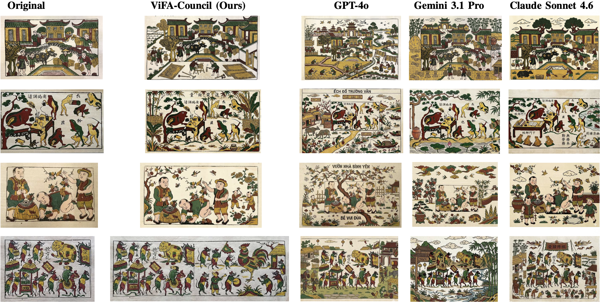
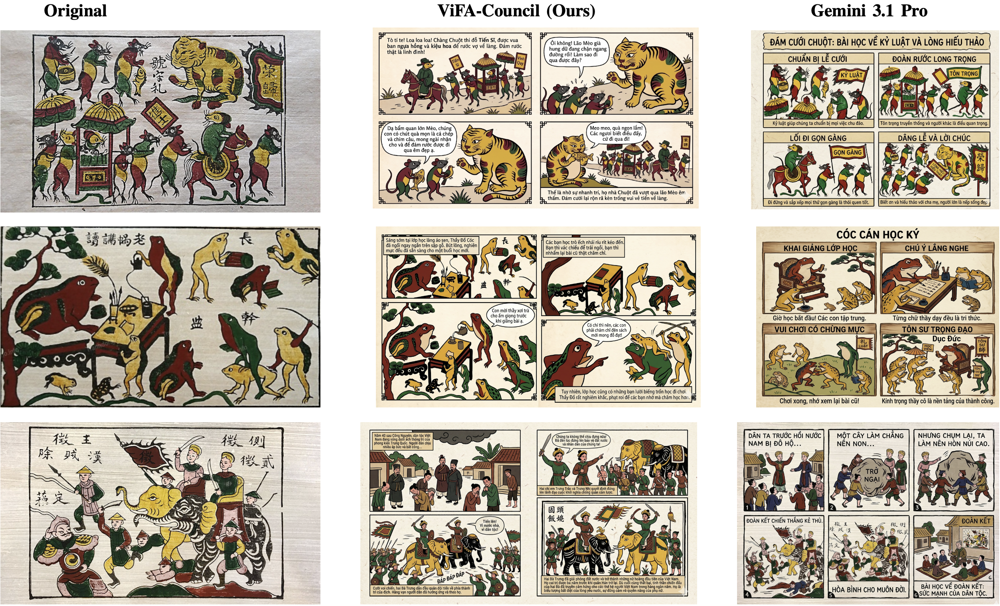

<div align="center">

# 🎨 ViFA-Council

### Multi-Agent LLM Deliberation for Vietnamese Folk Art Generation

[](#citation)
[](#prerequisites)
[](#prerequisites)
[](#license)

*GPT-4o · Gemini 3.1 Pro · Claude Sonnet 4.6 — deliberating as a Council to preserve Đông Hồ, Hàng Trống, and Kim Hoàng folk art traditions.*

</div>

---

## Overview

**ViFA-Council** is a paper-aligned, three-stage multi-agent framework that transforms traditional Vietnamese folk paintings into culturally faithful generative outputs. Single-model pipelines frequently hallucinate foreign motifs, inject modern typography, or flatten the authentic texture of folk art — ViFA-Council mitigates this through structured **cross-model deliberation** rather than relying on any single model's judgment.

Given a source painting and a user directive, the Council produces a **validated JSON specification** for one of two tasks:

- 🖼️ **Image Outpainting** — extends the canvas while preserving composition, palette, line work, motifs, and paper texture (*giấy điệp*).
- 📖 **Educational Story Generation** — prGiven a source painting and a user directive, the Council produces a **validated JSON specification** for one of two tasks:
poduces a multi-panel comic-style narrative with consistent characters, cultural context, and learning content, suitable for children's education.

> 📌 This repository is the reference implementation accompanying the paper *"ViFA-Council: Multi-Agent LLM Deliberation for Vietnamese Folk Art Generation"* (MAPR 2026). See [Citation](#citation) below.

---

## How it works

```text
                     source image + user directive
                                 │
                                 ▼
                     task-specific JSON schema
                     /                        \
              outpainting              story generation
                                 │
                                 ▼
   Stage 1 — Parallel Drafting
   GPT-4o, Gemini 3.1 Pro, and Claude Sonnet 4.6 each draft independently
                                 │
                                 ▼
   Stage 2 — Cross-Model Refinement
   every agent reviews & refines every draft (up to 3 × 3 = 9 candidates)
                                 │
                                 ▼
   Stage 3 — Chairman Adjudication
   an isolated Gemini 3.1 Pro instance anonymously ranks all candidates
                                 │
                                 ▼
        validated JSON  +  provider-neutral synthesis plan
                                 │
                                 ▼
      Nano Banana Pro execution → image persisted in the conversation
```

This separates *authorship* from *critique* (Stage 2) and *critique* from *final selection* (Stage 3), which the paper shows reduces systematic, model-specific biases far more effectively than round-robin or single-pass approaches.

---

## Results at a glance


*Original vs. ViFA-Council vs. GPT-4o, Gemini 3.1 Pro, and Claude Sonnet 4.6. ViFA-Council preserves folk-art texture and motifs while baselines drift toward typographic injection, Sino-centric motifs, or chromatic flattening.*


*Original vs. ViFA-Council vs. Gemini 3.1 Pro. ViFA-Council keeps the traditional comic-strip layout with culturally grounded dialogue, while Gemini drifts into modern infographic-style panels.*

| Task | Metric | Best Baseline | ViFA-Council (Ours) |
|---|---|---|---|
| Outpainting | JSON Semantic Score (%) | 84.30 (Claude) | **93.90** |
| Outpainting | DreamSim ↓ | 0.5896 (ChatGPT) | **0.5745** |
| Story Generation | JSON Semantic Score (%) | 87.0 (Gemini) | **93.0** |
| Story Generation | PickScore | 18.573 (Gemini) | **19.61** |
| Human Eval (Outpainting) | Overall Score (1–5) | 3.85 (Claude) | **4.05** |
| Human Eval (Story Gen.) | Overall Score (1–5) | 3.59 (Gemini) | **3.93** |


## Prerequisites

- Python 3.10 or newer
- [uv](https://docs.astral.sh/uv/)
- Node.js 22 and npm
- API credentials for OpenAI, Gemini, and Anthropic for a full three-agent run

---

## Setup

**1. Configure environment variables**

```bash
cp .env.example .env
```

For final image generation, set `NANO_BANANA_PRO_API_KEY` in `.env`. Nano Banana Pro uses a Gemini API key; when this dedicated value is empty, the backend falls back to `GEMINI_IMAGE_API_KEY` and then the shared `GEMINI_API_KEY`.

**2. Install backend dependencies** (from the canonical `pyproject.toml` and `uv.lock`)

```bash
uv sync
```

**3. Install frontend dependencies**

```bash
cd frontend
npm install
cd ..
```

`npm ci` may be used instead when a clean, lockfile-exact frontend install is preferred.

**4. Start both services**

```bash
./start.sh
```

The launcher never installs packages implicitly. If the backend environment has not been synchronized, either run `uv sync` yourself or explicitly opt in while starting:

```bash
./start.sh --sync
```

| Service | URL |
|---|---|
| API | `http://localhost:8000` |
| Web UI | `http://localhost:5173` |
| API documentation | `http://localhost:8000/docs` |

> ⚠️ The frontend currently expects the API on port 8000. Keep `VIFA_PORT=8000` unless `frontend/src/api.js` is made environment-configurable too.

---

## Run services separately

After `uv sync`:

```bash
uv run --no-sync python -m backend.main
```

In another terminal:

```bash
npm --prefix frontend run dev
```

---

## Repository layout

```text
backend/
  council.py                  reusable three-stage orchestration
  schemas.py                  validated task-specific JSON contracts
  prompt.py                   Stage 1, Stage 2, and Chairman prompts
  llm_client.py               provider adapters and retries
  OutpaintingCouncil.py        outpainting task facade
  StoryGenerationCouncil.py    story-generation task facade
  synthesis.py                 provider-neutral JSON-to-image plans
  image_client.py              Nano Banana Pro execution and local persistence
  main.py                      FastAPI and SSE API
frontend/                      React/Vite interface
local_storage/                 local uploaded-image fallback
```

---

## Citation

If you use ViFA-Council in your research, please cite:

```bibtex
@inproceedings{Dang2026MAPR,
  title     = {ViFA-Council: Multi-Agent LLM Deliberation for Vietnamese Folk Art Generation},
  author    = {Nguyen, Hai-Dang and Pham, Minh-Phuong and Dao, Thao Thi Phuong and Do, Trong-Le and Nguyen, Vinh-Tiep and Le, Trung-Nghia},
  booktitle = {International Conference on Multimedia Analysis and Pattern Recognition (MAPR)},
  year      = {2026}
}
```